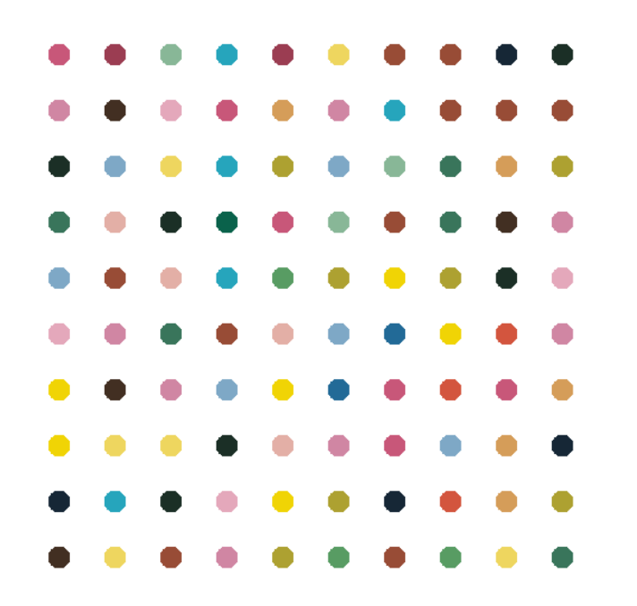

# 🎨 Dot Painting with Python
> A turtle-based rendition of Hirst-inspired dot painting 🟣🔵🟢 using just Python and creativity.

---

## 🚀 What is This?

This project generates a vibrant **dot painting** using Python’s built-in `turtle` graphics. It uses a pre-defined (or extracted) color palette to draw a grid of colorful dots — like pixel art, but painted with joy.

---

## 🎨 Output Preview

> This dot painting was generated using Python Turtle, inspired by Damien Hirst's iconic dot artwork style.

<p align="center">
  
</p>

## ✨ Features

- 🐢 Turtle-based visual output — zero extra graphics libraries
- 🎨 Optional color palette extraction using `colorgram.py`
- 🎯 Fully customizable dot size, spacing, and grid dimensions
- 🔁 Uses basic loops and coordinates — perfect for Python learners

---

## 🛠️ Getting Started

### 📦 Requirements
- Python 3.x
- `turtle` (built-in)
- `colorgram.py` *(optional)*

### 📥 Installation

```bash
git clone https://github.com/jim-ayushi-uw/dot_painting.git
cd dot_painting
pip install colorgram.py   # optional
